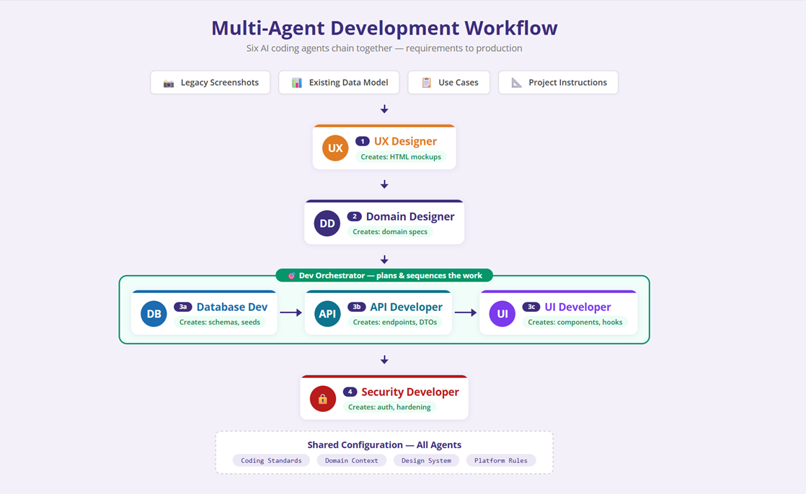

# AI Dev Team

An example of an **agentic development team** powered by [GitHub Copilot](https://github.com/features/copilot). This repository demonstrates how multiple specialized AI coding agents can collaborate to plan, build, and maintain a full-stack application — from requirements to production.



## How It Works

Six purpose-built GitHub Copilot agents chain together in a structured workflow, each owning a distinct phase of development:

| Step | Agent | Responsibility |
|------|-------|----------------|
| 1 | **UX Designer** | Creates HTML mockups from legacy screenshots, use cases, and project instructions |
| 2 | **Domain Designer** | Produces domain specs — entity definitions, relationships, and business rules |
| 3a | **Database Developer** | Generates schemas and seed data |
| 3b | **API Developer** | Builds endpoints, DTOs, and service layers |
| 3c | **UI Developer** | Implements React components and hooks |
| 4 | **Security Developer** | Adds authentication, authorization, and hardening |

A **Dev Orchestrator** agent plans and sequences steps 3a → 3b → 3c, coordinating the database, API, and UI work in the correct dependency order.

## Shared Configuration

All agents share a common foundation defined in this repository:

- **Coding Standards** — Language and framework conventions for .NET 10 and React
- **Domain Context** — Project-specific instructions and domain knowledge
- **Design System** — Consistent design tokens, spacing, and typography
- **Platform Rules** — Azure infrastructure, Cosmos DB access patterns, and security requirements

## Tech Stack

- **Frontend**: React
- **Backend**: .NET 10 microservice API
- **Data**: Azure Cosmos DB for NoSQL / Azure SQL Database
- **Auth**: Microsoft Entra ID
- **Cloud**: Microsoft Azure

## Repository Structure

```
.github/
  agents/          # Agent definitions (.agent.md files)
  instructions/    # Shared project instructions and context
  copilot-instructions.md  # Global Copilot coding standards
```

## Getting Started

1. Open this repository in VS Code with GitHub Copilot enabled.
2. Use the agents via Copilot Chat — invoke them by name (e.g., `@dev-orchestrator`) or let Copilot route to the appropriate agent.
3. Provide inputs such as mockups, use cases, or feature descriptions, and the agents will collaborate to produce working code.

## License

This project is provided as an example for educational purposes.
