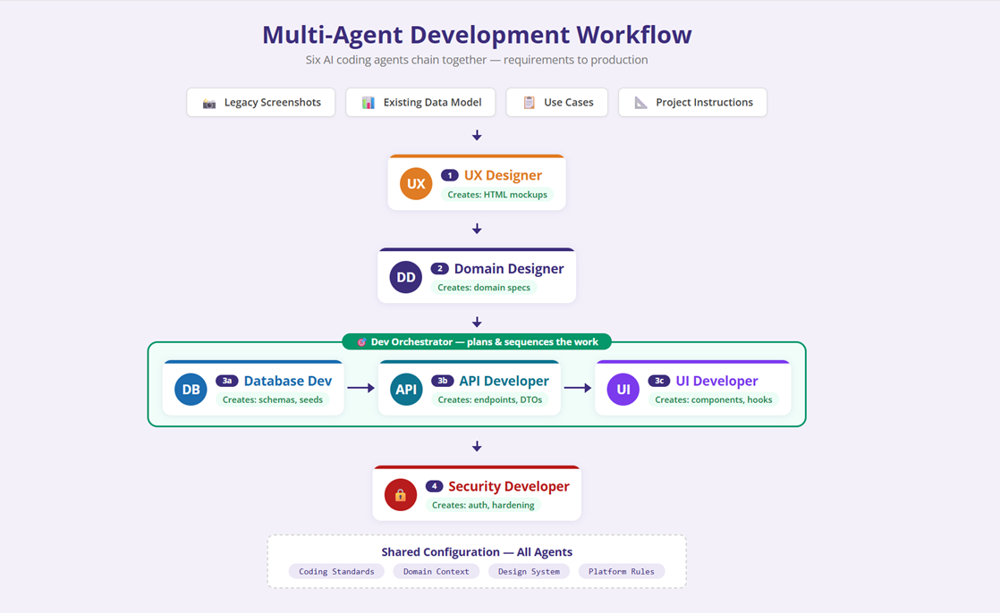

# AstraTerra — AI Agent Dev Team

Six AI coding agents chain together to turn legacy screenshots into a deployed, full-stack application — no human code required.



## How It Works

You give the agents source material — a legacy UI mockup, use cases, and project instructions. They take it from there, each one producing artifacts that the next agent consumes:

| Step | Agent | What it creates |
|------|-------|-----------------|
| **1** | **UX Designer** | Modern HTML/CSS mockups from the legacy UI |
| **2** | **Domain Designer** | Entity specs, relationships, and business rules |
| **3a** | **Database Dev** | SQL schemas, EF Core entities, seed data |
| **3b** | **API Developer** | .NET controllers, services, DTOs |
| **3c** | **UI Developer** | React components, hooks, API wiring |
| **4** | **Security Dev** | Auth config, hardening, pre-commit review |

Steps 3a → 3b → 3c run in strict sequence — each depends on the previous output. The **Dev Orchestrator** agent plans and sequences this automatically.

### Two Ways to Run

**Option A — Fully automated.** Point the orchestrator at the pre-built plan and let it drive:

```
Follow the plan in build-with-claude.md to build the full application
from the legacy mockup at docs/mockups/at-dashboard.html
```

**Option B — Phase by phase.** Invoke each agent directly:

```
@ux-designer  build a modern dashboard mockup from docs/mockups/at-dashboard.html
```
```
@dev-orchestrator  create the application for the modern AT dashboard,
from database scripts up through the API and UI layers
```

## What Gets Built

An interplanetary study abroad portal for the fictional **TerraFirma Polytechnic**:

- **Dashboard** — enrollment overview, headcount by program track, portal alerts, travel holds
- **Traveler Search** — searchable, sortable traveler list with filtering
- **Traveler Record** — tabbed detail view (demographics, program track, transit schedule, evaluations, holds)
- **Program Applications** — search tracks, apply, waitlist management
- **Transit History** — term-by-term history with cumulative progress

## Tech Stack

| Layer | Technology |
|-------|------------|
| Frontend | React 19, Radix UI Themes, Vite |
| Backend | .NET 10 REST API, EF Core |
| Database | Azure SQL |
| Compute | Azure Container Apps |
| Auth | Microsoft Entra ID (Easy Auth) |
| Infrastructure | Terraform, Azure Developer CLI (`azd`) |

## Project Structure

```
.github/
  agents/             ← Agent definitions (one per role)
  instructions/       ← Shared coding standards
  copilot-instructions.md
docs/
  mockups/            ← Legacy + modern mockups (static HTML)
  design/             ← Domain design specs
infra/terraform/      ← Azure infrastructure-as-code
scripts/              ← SQL setup + deployment scripts
src/
  api/                ← .NET API (AstraTerra.Api)
  web/                ← React frontend
```

## Getting Started

### Prerequisites

- [VS Code](https://code.visualstudio.com/) with GitHub Copilot
- [.NET 10 SDK](https://dotnet.microsoft.com/)
- [Node.js LTS](https://nodejs.org/)
- [Azure CLI](https://learn.microsoft.com/cli/azure/) + [Azure Developer CLI (`azd`)](https://learn.microsoft.com/azure/developer/azure-developer-cli/)

### Configure SQL Admin

```bash
az ad signed-in-user show --query "{displayName: displayName, id: id}" -o json

azd env set SQL_ADMIN_DISPLAY_NAME "Your Name"
azd env set SQL_ADMIN_OBJECT_ID "your-object-id-guid"
```

### Run Locally

```bash
# API
cd src/api/AstraTerra.Api && dotnet run

# Frontend (separate terminal)
cd src/web && npm install && npm run dev
```

### Deploy to Azure

```bash
azd up
```

## Key Files

| Path | Purpose |
|------|---------|
| [`build-with-claude.md`](build-with-claude.md) | Pre-built phased plan for the agents to follow |
| [`docs/mockups/at-dashboard.html`](docs/mockups/at-dashboard.html) | Legacy "before" mockup |
| [`docs/agent-workflow-generic.html`](docs/agent-workflow-generic.html) | Interactive version of the workflow diagram above |
| [`.github/agents/`](.github/agents/) | Agent definitions (one file per role) |
| [`.github/copilot-instructions.md`](.github/copilot-instructions.md) | Coding standards shared across all agents |
| [`scripts/`](scripts/) | SQL setup scripts + runner |
| [`src/api/`](src/api/) | .NET API (agent-generated) |
| [`src/web/`](src/web/) | React frontend (agent-generated) |